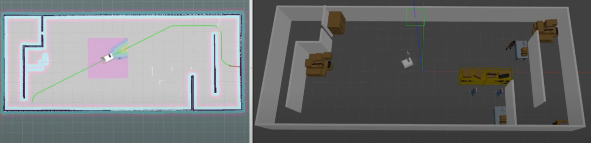

# Local Planner Benchmarking

This is the code for Benchmarking local motion planners for navigation of mobile manipulators, IEEE/SICE International Symposium on System Integration (SII), 2023.



This is the code for Benchmarking local motion planners for navigation of mobile manipulators, IEEE/SICE International Symposium on System Integration (SII), 2023.

The purpose of the code is to benchmark local planners found in the ROS framework. The benchmarking is done through simulations in Gazebo. Our simulations were run using a mobile manipulator that is found in the Chalmers University of Technology labs called DORA, but any mobile manipulator can be used to run the benchmark.

# Dependencies

Before starting the benchmarking, make sure that you have all the necessary ros packages installed. You can do this by running

```
rosdep install --from-paths src --ignore-src -r -y
```
From the catkin workspace after downloading this package into your src folder.

For the python code, 

# Structure

The main benchmarking code is found in the directory `benchmarking`, where the code is explained [there](benchmarking/README.md).

The folders `bh282_hand`, `mir100_mobile_base`, `ur10_arm` comprise of the files necessary to simulate the each component of the mobile manipulator in Gazebo (URDFs, meshes, etc.). the directory `mobile_manipulator` contains the combined mobile manipulator files.

 The directory `mir_navigation` has the configuration, and launch files necessary for the navigation stack implementation of the robot used.

# Starting the benchmarking

The benchmarking can be started with the file `start_trial.py` in `benchmarking/src`.  you can start it with

```
    python3 start_trial.py [parameters]
```

where the parameters describe which world is used, which local planner is used, among other things.

Here is the order which you would need to provide the parameters:

1. World used.
2. Local planner used.
3. If there are to be added obstacles.
4. If the arm is to be moved during the benchmarking.
5. How many trials the benchmarking would run for.

The default parameters are "new_maze", "DWB", not dynamic, arm stationary, 10 trials.

---

If you found the code useful, please consider citing our paper:

```
@INPROCEEDINGS{10039133,
  author={Tafnakaji, Sevag and Hajieghrary, Hadi and Teixeira, Quentin and Bekiroglu, Yasemin},
  booktitle={2023 IEEE/SICE International Symposium on System Integration (SII)}, 
  title={Benchmarking local motion planners for navigation of mobile manipulators}, 
  year={2023},
  volume={},
  number={},
  pages={1-6},
  doi={10.1109/SII55687.2023.10039133}}

```
